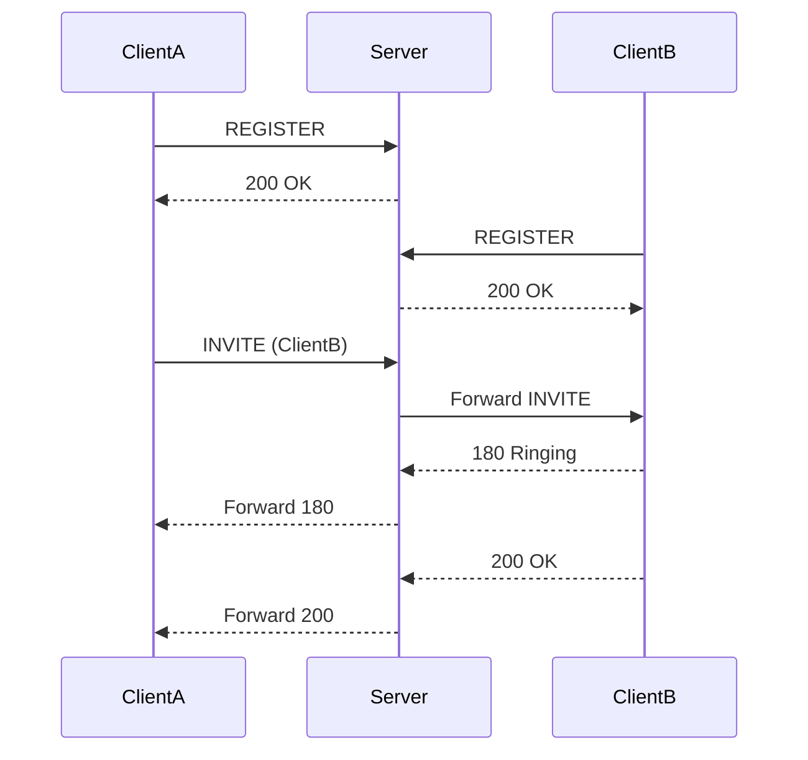

# SIP over WebSocket Implementation


[](https://github.com/andikatjacobdennis/sip-over-websocket/actions/workflows/codeql-analysis.yml)
[](https://github.com/yourusername/sip-over-websocket/issues)

A production-ready SIP (Session Initiation Protocol) implementation using WebSockets for modern real-time communication systems.

## Table of Contents

- [Features](#features)
- [Architecture](#architecture)
- [Installation](#installation)
- [Usage](#usage)
- [Configuration](#configuration)
- [Troubleshooting](#troubleshooting)
- [Contributing](#contributing)
- [License](#license)

## Features

✔️ Full SIP protocol over WebSocket (RFC 7118)  
✔️ REGISTER/INVITE/BYE/OPTIONS methods  
✔️ Call state tracking and management  
✔️ Scalable server architecture  
✔️ Interactive console client  
✔️ .NET 9+ optimized performance  

## Architecture



## Installation

### Prerequisites

- .NET 9.0+ SDK
- WebSocket-compatible environment

```bash
git clone https://github.com/yourusername/sip-over-websocket.git
cd sip-over-websocket
dotnet restore
```

## Usage

**Start Server:**

```bash
cd SipServer
dotnet run --port 8089
```

**Start Client:**

```bash
cd SipConsoleClient
dotnet run
```

## Configuration

Edit `appsettings.json`:

```json
{
  "SipSettings": {
    "Domain": "yourdomain.com",
    "WebSocketServer": "wss://yourdomain.com:8089",
    "DefaultExpires": 3600
  }
}
```

## Troubleshooting

### Common Issues

| Symptom | Solution |
|---------|----------|
| Connection refused | Verify server is running (`netstat -tulnp \| grep 8089`) |
| WebSocket handshake failed | Check if port 8089 is open in firewall |
| "User not found" errors | Verify username exists in server's `_users` dictionary |
| Call not establishing | Check both clients are registered (`S` key on server) |
| Unexpected disconnects | Increase keepalive interval in client |

### Debugging Tips

1. **Server Logs**:

   ```bash
   dotnet run --loglevel Debug
   ```

2. **Test WebSocket Connection**:

   ```bash
   wscat -c ws://localhost:8089
   ```

3. **Network Inspection**:

   ```bash
   tcpdump -i any -n port 8089 -w sip_capture.pcap
   ```

4. **Client Verbose Mode**:

   ```bash
   dotnet run --verbose true
   ```

## Contributing

1. Fork the repository
2. Create your feature branch (`git checkout -b feature/amazing-feature`)
3. Commit your changes (`git commit -m 'Add some amazing feature'`)
4. Push to the branch (`git push origin feature/amazing-feature`)
5. Open a Pull Request

## License

Distributed under the MIT License. See `LICENSE` for more information.
