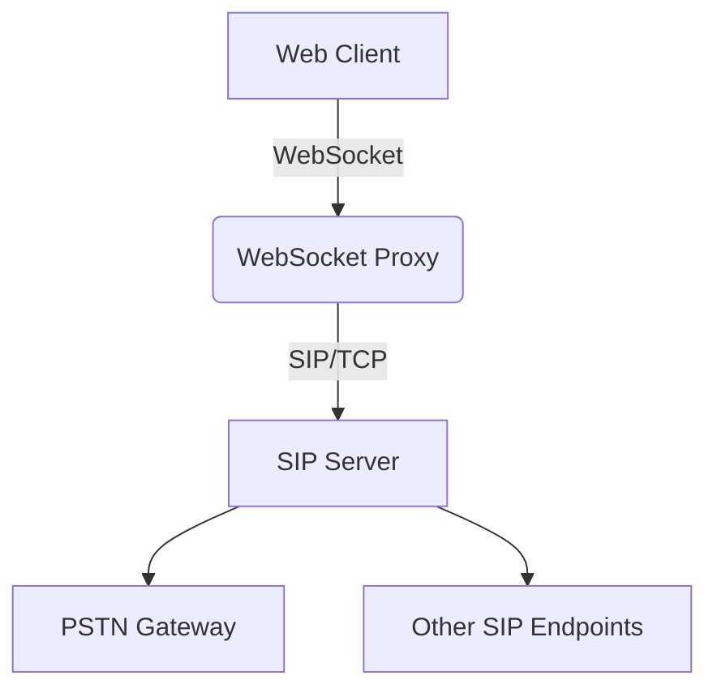

# Architecture Documentation 

## Overview
This document describes the architecture of a SIP (Session Initiation Protocol) implementation over WebSockets, enabling real-time communication in web browsers and WebRTC applications.

## System Diagram


## Core Components

### 1. WebSocket Transport Layer
- **Purpose**: Bridges WebSocket connections to SIP traffic
- **Key Features**:
  - Implements RFC 7118 (SIP over WebSocket)
  - TLS 1.3 encryption for all connections
  - Connection keep-alive via WebSocket pings
- **Components**:
  - `WebSocketListener`: Handles WS connections
  - `SIPTranslator`: Converts between SIP/WS formats

### 2. SIP Core Engine
- **Protocol Stack**:
  ```
  Application Layer (SIP)
  Session Layer (WebSocket)
  Transport Layer (TCP/TLS)
  ```
- **Supported Methods**:
  - REGISTER, INVITE, ACK, BYE, CANCEL
  - OPTIONS (for keep-alive)

### 3. Session Management
- **State Machine**:
  ```mermaid
  stateDiagram
      [*] --> Idle
      Idle --> Progressing: INVITE received
      Progressing --> Confirmed: 200 OK
      Confirmed --> Terminated: BYE
  ```
- **Storage**:
  - Redis for session state
  - PostgreSQL for persistent data

## Data Flow

### Registration Sequence
1. Web Client → WS: SIP REGISTER
2. WS Proxy → SIP Server: TCP SIP REGISTER
3. SIP Server → WS Proxy: 200 OK
4. WS Proxy → Web Client: WS 200 OK

### Call Establishment
1. Caller sends INVITE over WebSocket
2. Proxy routes to SIP server
3. Callee responds with 180 Ringing
4. On answer, 200 OK completes establishment

## Scalability Design

### Horizontal Scaling
- WebSocket proxies are stateless
- SIP servers use consistent hashing for call routing
- Redis pub/sub for cross-node messaging

### Failover Mechanism
- Health checks every 5 seconds
- Automatic DNS failover
- Session re-establishment protocol

## Security Architecture

### Encryption Layers
1. WSS (WebSocket Secure)
2. SIP over TLS
3. Media encryption via SRTP

### Protection Mechanisms
- Rate limiting (100 reqs/second per IP)
- SIP message validation
- WebSocket origin verification

## Performance Characteristics

| Metric          | Target        |
|-----------------|--------------|
| Latency         | < 200ms RTT  |
| Throughput      | 10k msg/sec  |
| Session Capacity| 50k concurrent|

## Dependencies
- `ws` (WebSocket library)
- `PJSIP` (SIP stack)
- `Redis` (session store)
- `Prometheus` (monitoring)

## Monitoring
- Grafana dashboard tracking:
  - WebSocket connections
  - SIP message rates
  - Call success/failure rates
  - System resource usage

## Evolution Roadmap
1. Phase 1: Basic call functionality
2. Phase 2: NAT traversal support
3. Phase 3: Load testing framework
4. Phase 4: Cluster deployment mode
