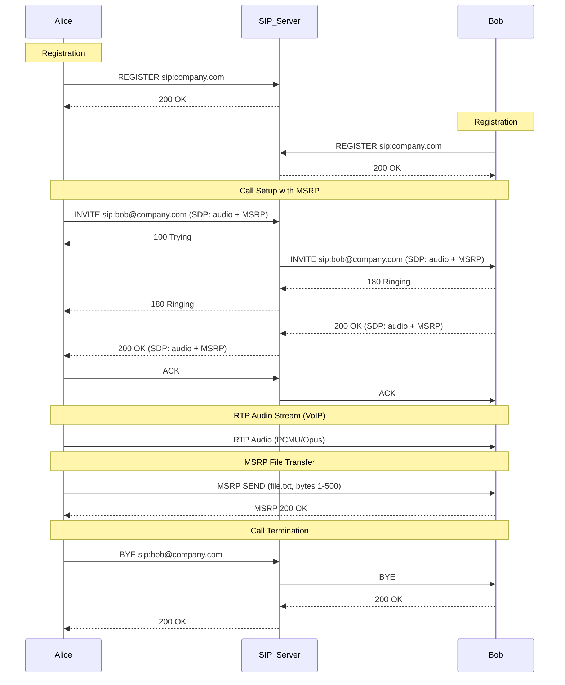

# Detailed SIP Message Flow: Registration, VoIP, and File Transfer

## Comprehensive Example Including SIP, SDP, and MSRP

SIP (**Session Initiation Protocol**) is a robust signalling protocol used for managing multimedia communication sessions such as voice and video calls, instant messaging, and file transfers. Below, you’ll find a full message flow example that illustrates a typical SIP-based session involving user registration, voice call setup and teardown, as well as file transfer using MSRP (Message Session Relay Protocol).



## Example SIP Message Flow with VoIP and File Transfer

### 📌 **REGISTRATION PHASE**

Both users register their location (IP and port) with the SIP server.

#### 1. Alice registers:

```
Alice → SIP Server:
REGISTER sip:company.com SIP/2.0
Contact: <sip:alice@192.168.1.100:5060>
Expires: 3600
```

```
SIP Server → Alice:
SIP/2.0 200 OK
Contact: <sip:alice@192.168.1.100:5060>;expires=3600
```

#### 2. Bob registers:

```
Bob → SIP Server:
REGISTER sip:company.com SIP/2.0
Contact: <sip:bob@192.168.1.200:5060>
Expires: 3600
```

```
SIP Server → Bob:
SIP/2.0 200 OK
Contact: <sip:bob@192.168.1.200:5060>;expires=3600
```


### 📌 **CALL ESTABLISHMENT PHASE**

Alice initiates a call to Bob using SIP INVITE and includes SDP to offer audio and file transfer capabilities via MSRP.

#### 3. Alice initiates call:

```
Alice → SIP Server:
INVITE sip:bob@company.com SIP/2.0
Content-Type: application/sdp
Body:
  v=0
  o=alice 2890844526 2890844526 IN IP4 192.168.1.100
  m=audio 5004 RTP/AVP 0 8
  m=message 5006 TCP/MSRP *
  a=accept-types:text/plain
  a=path:msrp://192.168.1.100:5006
```

#### 4. SIP Server acknowledges receipt:

```
SIP Server → Alice: 100 Trying
```

#### 5. SIP Server forwards INVITE to Bob.

#### 6. Bob starts ringing:

```
Bob → SIP Server: 180 Ringing
```

#### 7. SIP Server forwards ringing to Alice:

```
SIP Server → Alice: 180 Ringing
```

#### 8. Bob answers:

```
Bob → SIP Server:
200 OK
Content-Type: application/sdp
Body:
  v=0
  o=bob 2890844731 2890844731 IN IP4 192.168.1.200
  m=audio 6004 RTP/AVP 0
  m=message 6006 TCP/MSRP *
  a=path:msrp://192.168.1.200:6006
```

#### 9. SIP Server forwards 200 OK to Alice.

#### 10–11. Call is confirmed with ACK:

```
Alice → SIP Server: ACK
SIP Server → Bob: ACK
```


### 📌 **MEDIA SESSION PHASE**

#### 12. **RTP Audio Communication:**

```
Bi-directional RTP audio:
Alice (192.168.1.100:5004) ⇄ Bob (192.168.1.200:6004)
```

#### 13. **File Transfer using MSRP:**

```
Alice → Bob:
MSRP d93k SEND
To-Path: msrp://192.168.1.200:6006
From-Path: msrp://192.168.1.100:5006
Byte-Range: 1-500/500
Content-Type: text/plain
[File data...]----d93k$
```

```
Bob → Alice:
MSRP d93k 200 OK----d93k$
```


### 📌 **CALL TERMINATION PHASE**

#### 14. Alice hangs up:

```
Alice → SIP Server: BYE sip:bob@company.com
```

#### 15. SIP Server forwards BYE to Bob.

#### 16–17. Call is terminated:

```
Bob → SIP Server: 200 OK
SIP Server → Alice: 200 OK
```


### ✅ Summary

| Phase            | Protocol  | Purpose                    |
| ---------------- | --------- | -------------------------- |
| Registration     | SIP       | User location binding      |
| Call Setup       | SIP + SDP | Negotiate media parameters |
| Media Session    | RTP, MSRP | Voice and file transfer    |
| Call Termination | SIP       | Tear down the session      |

**📌 CALL TERMINATION PHASE**

**14\. Alice hangs up:**

Alice → SIP Server: BYE sip:bob@company.com

**15\. SIP Server forwards BYE to Bob.**

**16–17. Call is terminated:**

Bob → SIP Server: 200 OK

SIP Server → Alice: 200 OK

SIP Response Codes Table

## 📘 **SIP Response Codes Table**

| Code                   | Category                   | Meaning                         | Typical Use Case                       |
| ---------------------- | -------------------------- | ------------------------------- | -------------------------------------- |
| **1xx – Provisional**  | *Informational responses*  |                                 |                                        |
| 100                    | Trying                     | Request received, processing    | Initial response to INVITE             |
| 180                    | Ringing                    | Callee is being alerted         | Phone is ringing                       |
| 183                    | Session Progress           | Call is being set up            | Early media (e.g., call waiting tones) |
| **2xx – Success**      | *Successful responses*     |                                 |                                        |
| 200                    | OK                         | Request succeeded               | REGISTER, INVITE, BYE, etc.            |
| **3xx – Redirection**  | *Further action needed*    |                                 |                                        |
| 301                    | Moved Permanently          | Use new contact                 | SIP address changed permanently        |
| 302                    | Moved Temporarily          | Use alternative contact         | Temporary redirection                  |
| **4xx – Client Error** | *Request has a problem*    |                                 |                                        |
| 400                    | Bad Request                | Malformed request               | Syntax error in SIP message            |
| 401                    | Unauthorized               | Authentication required         | REGISTER or INVITE needs credentials   |
| 403                    | Forbidden                  | Server refuses to fulfill       | Access denied                          |
| 404                    | Not Found                  | User not found                  | Target SIP URI does not exist          |
| 407                    | Proxy Auth Req             | Auth required at proxy          | Used by SIP proxies                    |
| 415                    | Unsupported Media Type     | Unsupported body format         | SDP/media type not supported           |
| 486                    | Busy Here                  | User is busy                    | Callee is currently on another call    |
| **5xx – Server Error** | *Server failed to fulfill* |                                 |                                        |
| 500                    | Server Internal Error      | Server failure                  | Unexpected internal problem            |
| 503                    | Service Unavailable        | Temporarily unavailable         | Overload, maintenance                  |
| **6xx – Global Error** | *Global failure*           |                                 |                                        |
| 600                    | Busy Everywhere            | No point in trying other routes | All endpoints are busy                 |
| 603                    | Decline                    | Call rejected                   | User chose not to accept the call      |
